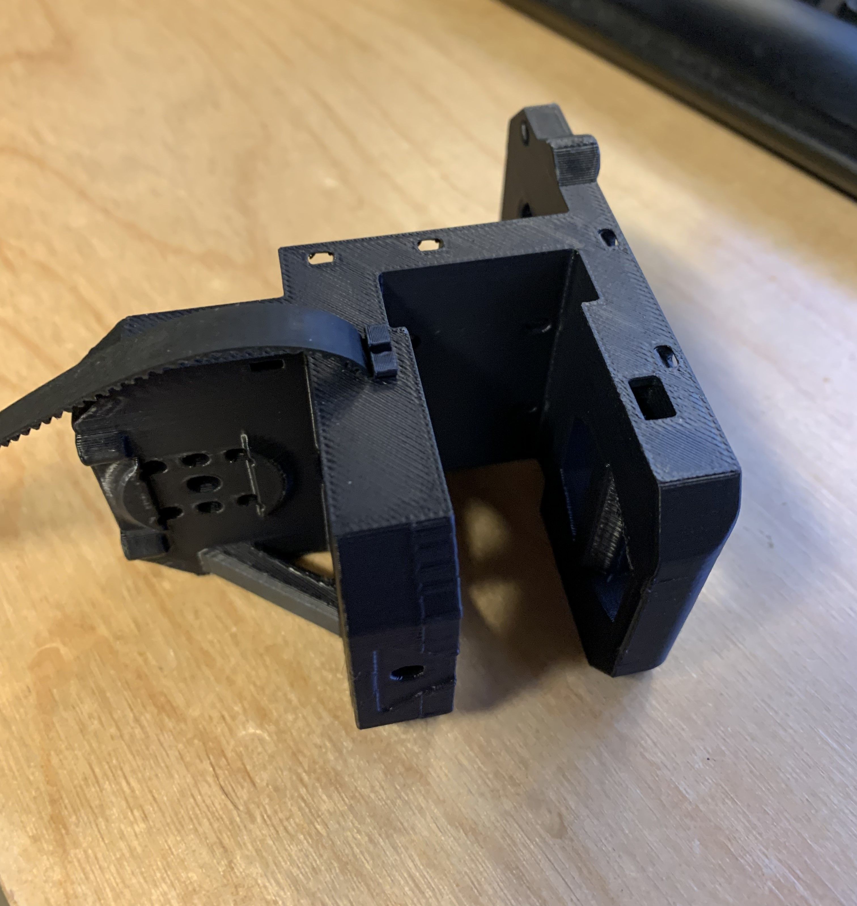
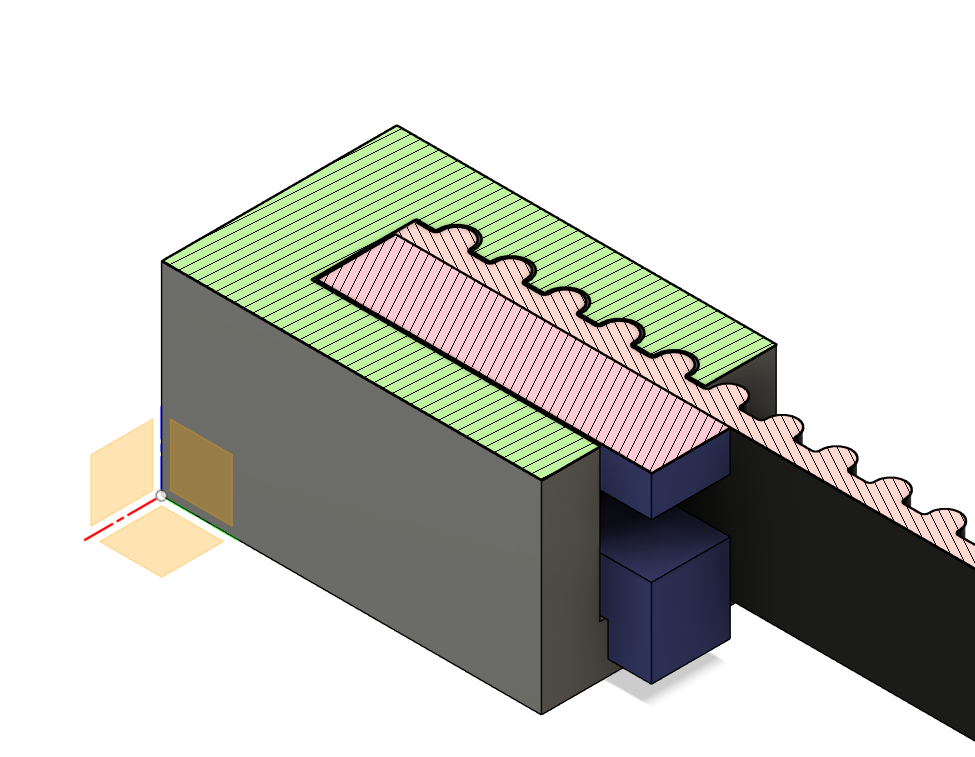
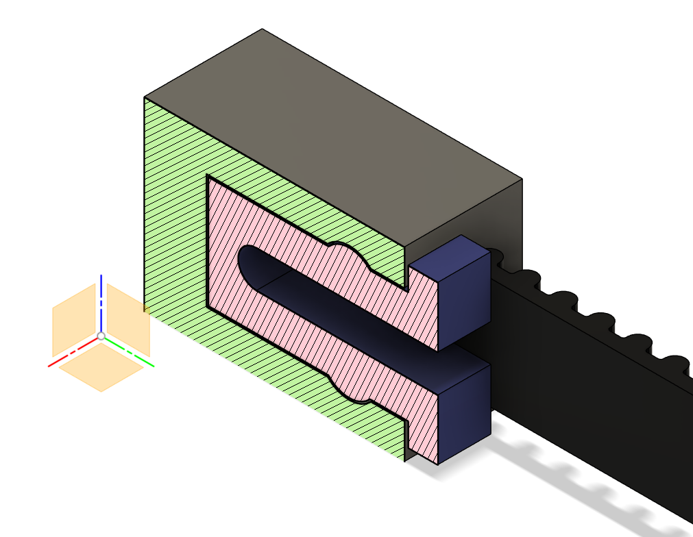
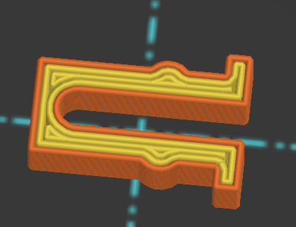

# ApexClips - 3d printer belt mounting

Originally designed for my [fork](https://github.com/ApexArray/Medusa-Toolhead) of [Ch4rlesB's Medusa Toolhead](https://github.com/Ch4rlesB/Medusa-Toolhead/tree/main), but I think this design deserves its own repo now.

This solution aims to be a zero-comporomise method of mounting belts to 3d printer toolheads.

- **Lightweight:** No screws or heat inserts required.
- **Strong:** Tested up to 40 lbs before failure.
- **Low-profile:** End tabs are less than 2mm thick, so they shouldn't interfere with X homing.
- **Easy to assemble:** No need to disassemble the toolhead or fight with zip ties.
- **Tool-less:** Although installation is easier with pliers/tweezers if you have fat fingers like me.
- **Adaptable:** Includes a [step file](./cutout%20tool/Cutout%20Tool%20(v0.1).step) cutout tool, so it can be easily adapted to other toolheads.

## Installation

Insert the belt into the slot, and slide in the printable clip to hold it in place.

Here it is holding 20lbs

[RMRRF 2024: Quick Demonstration](https://twitter.com/Fabreeko_Hector/status/1782216324544115053)

**TIP:** It can be tricky when the clip needs to go between the belt and the gantry (teeth facing outward). Try holding the belt with one hand and insert the clip using tweezers or pliers.

## Try it out

I included a small "test body", so you don't need to print a whole toolhead to test the clips.

Print the STLs, install a belt and see if you can pull it out!

## FAQ

**How does it work?**

The belt teeth sit in grooves on the inside of the toolhead. Since the belt must first move in the X direction (backing out of the grooves) before it can move in the Y direction (sliding out of the slot), we simply occupy the space behind the belt to keep it in the grooves.

**Can I use this in my toolhead?**

Please do! Send me a link so I can check it out.

**Why these specific dimensions?**

The arms are wide enough for three full walls. This seemed to be the happy medium for flexiibility and durability.

The mount is strong enough with just three teeth, but I decided on five teeth for extra reliability.

**The mounts failed and my belt came out!**

Make sure the belt is inserted deep enough to engage all five teeth. It might help to mark the belt so you know when you've inserted it to the right depth.

If it still doesn't hold, try printing the clips at a slightly larger scale.

**Does it hold up over time?**

Great question! I've had zero failures so far, but I sadly don't have much printing time with them because I'm always taking my printer apart to test new things. Please share your results if you decide to use this method.

## Feedback and Suggestions

Feel free to open a PR or give me a shout on Discord @Apex3d.

## TODO

- Beta testing - any volunteers? 🙂
- Add a flush-mount version (just need to find a way to get the clip out after installation).
- Make an installation helper tool (for the tricky spots).
- Re-design everything in FreeCAD/Ondsel.
- Get this method into every toolhead possible.

## Inspiration

Heavily inspired by [@ChipCE](https://github.com/ChipCE)'s awesome panel clips from the [SnakeOil-XY](https://github.com/SnakeOilXY/SnakeOil-XY/tree/master).

## LICENSE

All files released under [GNU General Public License v3.0](./LICENSE.md).